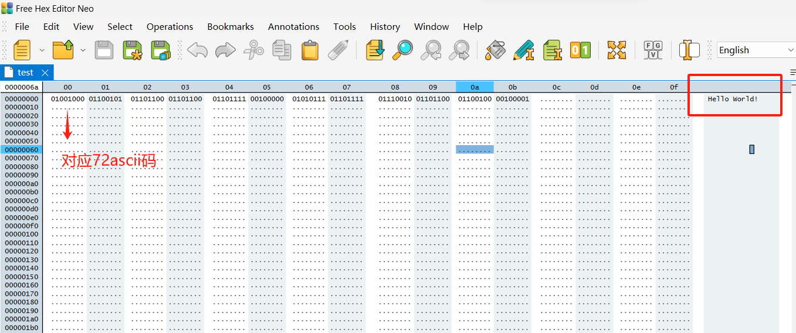
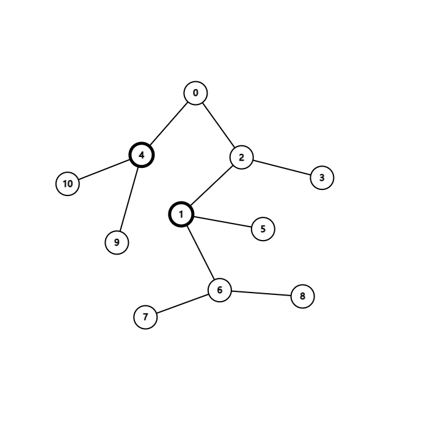

# 欢迎来到压缩工具

## 简介

### 前言

这个压缩工具用的是动态哈夫曼编码，而不是普通的哈夫曼编码。这个大作业已经做了80%了，然后解压的参考代码在./files/vitter.cpp里，然后vscode必备神器copilot你也可以下一个，学生认证免费用，树的部分已经敲完了，解码的部分重要难在文件处理，和源代码阅读，可能需要一定的努力，相信惠姐实力！

话不多说，先上视频！

[Adaptive Huffman Encoding 练习讲解_哔哩哔哩_bilibili](https://www.bilibili.com/video/BV1Ex411k7AR/?spm_id_from=333.337.search-card.all.click)

### 基本用法

将待压缩的文件放入 files 文件夹，运行ziptool.exe根据提示进行压缩，压缩成功后会出现success字样。 压缩后文件会添加.ah(Adaptive Huffuman)后缀，解压后会添加r:前缀**(TODO)**以及恢复后缀

如 img.png -> img.png.ah -> r:img.png


### 文件介绍

#### .git 用于版本管理

目前只有第一个版本，写完了可以稳定运行(吧)的压缩代码

#### .vscode 用于存放vscode配置文件

#### build 用于存放cmake及makefile相关构建文件

编译环境配置：首先配置cmake，然后在vscode中crtl+`打开终端创建powershell终端

```powershell
cd build
cmake .. -G "MinGW Makefiles"
mingw32-make.exe
```

配置完构建目录后，以后需要重新编译运行代码时，首先crtl+`打开终端，只需要进行如下操作可以对源码进行编译(或者下载cmake插件，一键生成，详搜b站)

```powershell
cd build
mingw32-make.exe
cd ..
ziptool.exe
```

#### images 存放本文档图片

#### include 存放头文件

#### src 存放源文件

#### CMakeLists.txt介绍

这是一个cmake文件，用于编译src/下的源文件以及include/下的头文件，这样编译的好处是，源文件之间不用相互引用也可以互相调用互相的函数、类。在引用头文件时也可以进行简化


## 开发相关知识

### 比特相关知识

十六进制表示二进制

​	0x**a**a:**0101** 0101

​	0x0**2**:0000 **0010**

一个文件的最小单位是字节byte，一个字节的大小等于一个char的大小，所以说，本次文件的读写以char为单位。而一个byte又包含8个bit，哈夫曼树的读写是以bit为单位，所以说，文件读写的难点是要将byte流转化为bit流读入文件

下图演示了一个文件及其二进制表示



C++提供了bit层面的数据操作<<和>>

```c++
char a = 0x30 // 移位之前：0011 0000
print(a<<1)   // 左移一位：0110 0000
print(a>>1)   // 右移一位：0001 1000
```

所以说将字节流转化为bit流可以通过以下函数,其中queue<char> code 就是比特流如0110 1010

```c++
void zip::write8bits(std::ofstream *outfile, std::queue<char> *code)
{
    unsigned char buffer = 0x00; 
    for (int i = 0; i < 8; i++)     //获取8个bit写入buffer（byte）中
    {
        // std::cout << code->front();
        if (code->front() == '1')   //获取bit流
            buffer ^= 0x01;         
        if (i != 7)
            buffer <<= 1;

        code->pop();
    }
    (*outfile) << buffer;
    return;
}
```

从字节流转换到bit流可以参考如下函数

```c++
void unzip::read8bits(std::ifstream *file, std::queue<char> *code_read)
{
	char temp = 0x00;
	if ((*file).get(temp))
	{
		for (int i = 0; i < 8; i++)
		{
			if ((temp & 0x80) == 0x80)
				(*code_read).push('1');
			else
				(*code_read).push('0');
			temp <<= 1;
		}
	}
    return;
}
```

### 注意！！！！

由于经过动态哈夫曼编码后的bit流不是8的倍数，不一定能保证最后都能通过字节写入，然而文件的最小写入单位是字节，这就需要我们在最后补零，如:1000 01 -> 1000 0100

补零的个数由整个文件的第一个字节描述，这个数字表示最后补零的数量。若第一个字节为0000 0010则表示最后补了两个0

### 动态哈夫曼编码粗讲


## 代码介绍

源文件有五个代码，你要完成的时unzip.cpp中的源码开发**(TODO)**，其中
#### AdaptiveHuffmanNode.cpp

##### 私有变量

包含当前节点存放的字符data，字符数量weight，当前节点编号number，左子节点left，右子节点right，父亲节点parent

##### swap 函数

交换当前节点以及所有该节点的子节点，如1.swap(4)



##### 其他函数

```c++
    AdaptiveHuffmanNode(char data, int weight, AdaptiveHuffmanNode *left,AdaptiveHuffmanNode *right, AdaptiveHuffmanNode *parent)
    : data(data), weight(weight), left(left), right(right), parent(parent) {}
    AdaptiveHuffmanNode(){};
    char getdata(){return data;}
    int getweight(){return weight;}
    int getnumber(){return number;}
    AdaptiveHuffmanNode *getleft() { return left; }
    AdaptiveHuffmanNode *getright() { return right; }
    AdaptiveHuffmanNode *getparent() { return parent; }
    
    void setdata(char data) { this->data = data; }
    void setweight(int weight) { this->weight = weight; }
    void setleft(AdaptiveHuffmanNode *left) { this->left = left; }
    void setright(AdaptiveHuffmanNode *right) { this->right = right; }
    void setparent(AdaptiveHuffmanNode *parent) { this->parent = parent; }
    void setnumber(int number) { this->number = number; }
    void swap(AdaptiveHuffmanNode *node);
    void addweight();
```

#### AdaptiveHuffmanTree.cpp(核心代码)

整个树的整体，用来存放以及更新哈夫曼树，以及获取哈夫曼编码。

#### main.cpp

用于交互

#### zip.cpp

用于存放zip类：主要用来操作文件读写

其中第一个字节

#### unzip.cpp

TODO：解压

### 

### 
