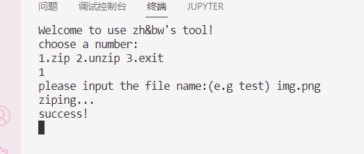

# 欢迎来到压缩工具

## 简介

### 前言

这个大作业已经做了69%了，树的部分已经敲完了，解码的部分重要难在文件处理，和源代码阅读，可能需要一定的努力，相信惠姐实力！

### 基本用法

将带压缩的文件放入 files 文件夹，运行ziptool.exe根据提示进行压缩，压缩成功后会出现success字样。 压缩后文件会添加.ah(Adaptive Huffuman)后缀，解压后会添加r:前缀**(TODO)**以及恢复后缀。

如 img.png -> img.png.ah -> r:img.png



### 文件介绍

#### .git 用于版本管理

目前只有第一个版本，写完了压缩代码，可以稳定运行(吧)。

#### .vscode 用于存放vscode配置文件

#### build 用于存放cmake及makefile相关构建文件

编译环境配置：首先配置cmake，然后在vscode中crtl+`打开终端创建powershell终端，

```powershell
cd build
cmake .. -G "MinGW Makefiles"
mingw32-make.exe
```

配置完构建目录后，以后需要重新编译运行代码时，首先crtl+`打开终端，只需要进行如下操作(或者下载cmake插件，一键生成，详搜b站)。

```powershell
cd build
mingw32-make.exe
cd ..
ziptool.exe
```

#### images 存放本文档图片

#### include 存放头文件

#### src 存放源文件

#### CMakeLists.txt介绍

这是一个cmake文件，用于编译src/下的源文件以及include/下的头文件，这样编译的好处是，源文件之间不用相互引用也可以互相调用函数、类，在引用头文件时也可以进行简化


## 代码介绍

源文件有五个代码，你要完成的时unzip.cpp中的源码开发**(TODO)**，其中
#### AdaptiveHuffmanNode.cpp

包含当前节点存放的字符data，字符数量weight，当前节点编号number，左子节点left，右子节点right，父亲节点parent。

## 开发相关

### 比特相关知识

### 文件相关知识

### 动态哈夫曼编码粗讲

